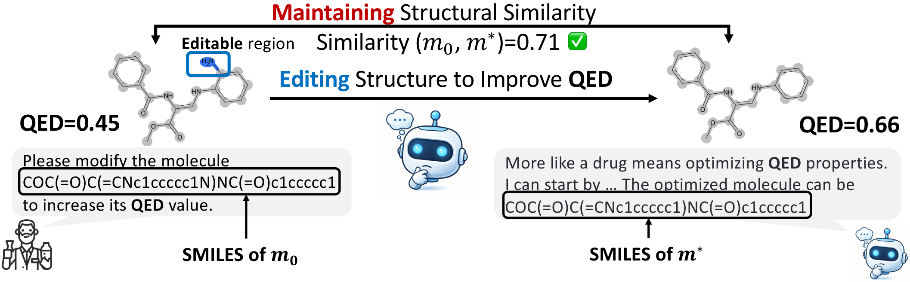
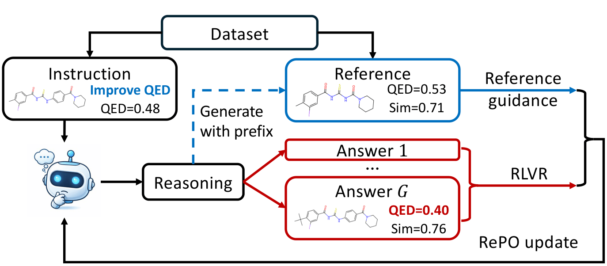

<div align="center">

# RePO: Reference-guided Policy Optimization for Molecular Optimization via LLM Reasoning

[](https://arxiv.org/abs/2603.05900) 
[](https://openreview.net/pdf?id=m4nvqQkm4X)

</div>

<table align="center">
  <tr>
    <td align="center" valign="bottom" width="55%">
      <br>
      <em>Instruction-based molecular optimization task</em>
    </td>
    <td align="center" valign="bottom" width="45%">
      <br>
      <em>RePO training objective</em>
    </td>
  </tr>
</table>

## Introduction

Large language models (LLMs) show great promise for instruction-based molecular optimization, but existing training recipes fall short: supervised fine-tuning (SFT) on reference molecules collapses intermediate reasoning by forcing the model to reproduce single answers, while reinforcement learning with verifiable rewards (RLVR) suffers from sparse feedback under similarity constraints because the model lacks effective exploration. Together, these limitations slow learning and cap optimization performance.

RePO (Reference-guided Policy Optimization) addresses both failure modes with a joint objective. An RL term samples candidate molecules and their reasoning trajectories from the model, then trains with verifiable rewards that measure property satisfaction under similarity constraints. A reference guidance term fixes the intermediate trajectory as context and trains only the final answer in a supervised manner, grounding outputs to known-good reference molecules when many valid edits exist. This combination promotes exploration while stabilizing training, and RePO consistently outperforms SFT and RLVR baselines (e.g., GRPO) on TOMG-Bench and MuMOInstruct without requiring any step-by-step trajectory data.

## Key Features

- **Identifies a supervision mismatch**: answer-only SFT suppresses reasoning; RLVR yields sparse rewards under similarity constraints — RePO resolves both simultaneously.
- **Three-term objective**: RL exploration + reference guidance + KL regularization, trained end-to-end from reference molecules alone.
- **State-of-the-art on TOMG-Bench**: achieves best results on 4 of 6 tasks, with up to 17.4% improvement over GRPO on the Success Rate $\times$ Similarity metric.
- **Inference-time scaling**: performance continues to improve with more inference-time compute.

## Quick Start

### 1) Environment

```bash
conda create -n repo python=3.10 -y
conda activate repo
pip install -r requirements.txt
pip install flash-attn
```

For MuMo multi-property training/evaluation, use a dedicated environment:

```bash
conda create -n mumo python=3.10 -y
conda activate mumo
pip install -r mumo_requirements.txt
```

### 2) MuMo Property Servers

MuMo training/evaluation depends on two local property APIs. Start both in `mumo` env (two terminals):

```bash
conda activate mumo
python multiprop_utils/admetModel_api.py
```

```bash
conda activate mumo
python multiprop_utils/drd2Model_api.py
```

Default endpoints:

- ADMET: `http://127.0.0.1:10086/predict/`
- DRD2: `http://127.0.0.1:10087/predict/`

### 3) RL Training

Use the unified training launcher:

```bash
bash scripts/run_RL_training.sh \
  --gpus 0,1,2 \
  --num_processes 2 \
  --entry src/x_r1/repo.py \
  --variant mumo \
  --config recipes/MulProp_3B_config.yaml \
  --output_dir ./output/repo_run
```

Common variants:

- `default`
- `mumo`
- `pure`
- `noisy_demo`
- `random_mask`

### 4) Single-Objective Testing

1. Generate Predictions

```bash
python generate_predictions.py \
  --model_path ./output/xxx/checkpoint-xxx \
  --benchmark open_generation \
  --task MolOpt \
  --subtask LogP \
  --output_dir ./predictions/
```

Notes:

- Outputs include CSV and JSONL artifacts under `./predictions/`.

2. Evaluate Predictions

```bash
bash scripts/run_full_evaluation.sh \
  --model_path ./output/repo_run/checkpoint-xxx \
  --task MolOpt \
  --subtasks LogP,MR,QED \
  --output_dir ./predictions/ \
  --device_id 0
```

### 5) Multi-Objective Testing

Use `mumo` env and ensure both MuMo property servers are running.

1. Inference (`inf.py`) on MuMo test data:

```bash
conda activate mumo
python inf.py \
  --model_path ./output/xxx/checkpoint-xxx \
  --data_path data/TEST_multi_prop/IND_sft_seen_bbbp+drd2+plogp_test_data.json \
  --output_dir ./output/xxx/checkpoint-xxx/bdp_repo \
  --output_name processed_IND_seen_bbbp+drd2+plogp_test_data.json \
  --gpu_memory_utilization 0.9
```

2. MuMo evaluation (`mumo_evaluate.py`):

```bash
conda activate mumo
python mumo_evaluate.py \
  --property_setting bbbp+drd2+plogp \
  --seen_setting seen \
  --IND_setting IND \
  --experiment_prefix bdp \
  --method_name repo \
  --output_folder MuMo_performance
```

Outputs include:

- `MuMo_performance/detailed_results_*.csv`
- `MuMo_performance/avg_differences_*.csv`
- `{experiment_dir}/{IND}_sft_{seen}_{property}.json`

### 6) Utility Scripts

- `mumo_evaluate.py`: computes MuMo-style success/similarity metrics from generated JSON.
- `cal.py`: small CSV utilities (`--mode count` / `--mode wsr`).

## Acknowledgement

This codebase builds on [X-R1](https://github.com/dhcode-cpp/X-R1). We thank the authors for their excellent open-source framework.

## Citation

```bibtex
@inproceedings{
  li2026repo,
  title={RePO: Reference-guided Policy Optimization for Molecular Optimization via LLM Reasoning},
  author={Li, Xuan and Zhou, Zhanke and Li, Zongze and Yao, Jiangchao and Rong, Yu and Zhang, Lu and Han, Bo},
  booktitle={International Conference on Learning Representations},
  year={2026},
}
```

## Contact

For questions or issues, please open a GitHub issue or contact csxuanli [AT] comp.hkbu.edu.hk